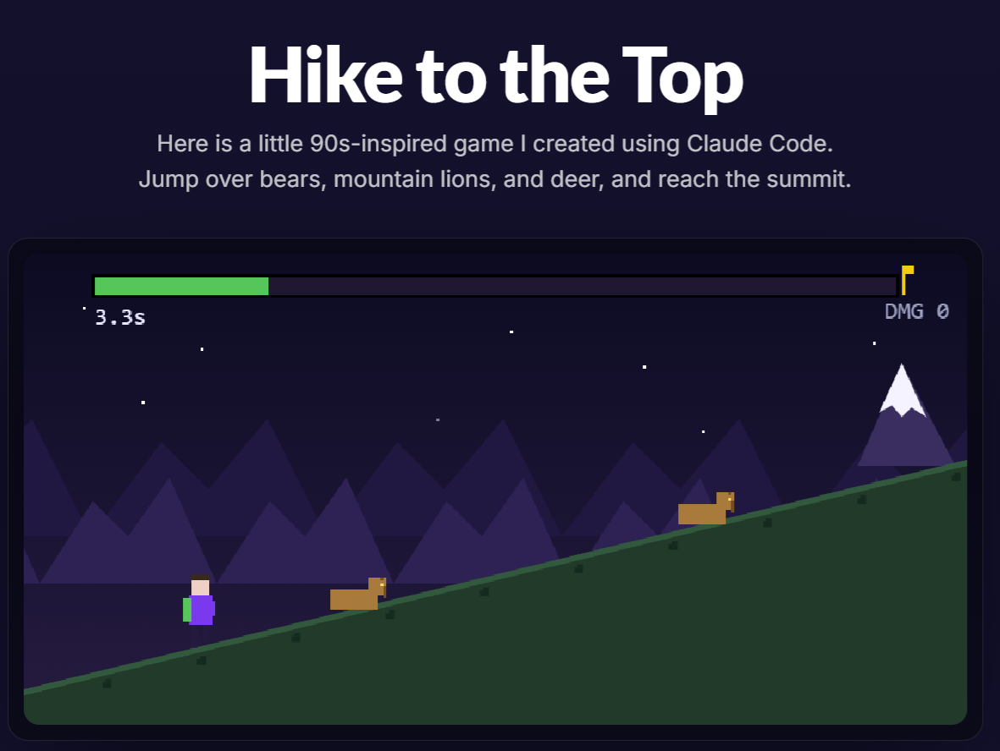

# Pixel Mountain Game

A tiny 90s-inspired pixel game. You are a hiker climbing a mountain. Jump over
bears, mountain lions, and deer, and reach the summit. When you get there, the
hiker throws both fists in the air, confetti falls, and a rotating Marcus
Aurelius quote appears on a regal plaque.

It is a single self-contained React component that draws everything on an HTML
canvas. No game engine, no sprite sheets, no external art. Every pixel is drawn
with `fillRect`. That makes it small, fast, and easy to read and extend.



## Features

- Pure canvas rendering at a low logical resolution (320 x 160), scaled up with
  crisp, non-smoothed pixels for a chunky retro look.
- One-button play: press Space, click, or tap to jump.
- An uphill slope, parallax mountains, a twinkling starfield, and a summit peak
  that grows as you climb.
- No losing. Bumping a critter adds to your damage score and knocks you back
  down the hill, so a clean climb is simply faster.
- A summit celebration with confetti, a fist-pump animation, run stats, and a
  rotating quote.
- Best time saved to `localStorage`.
- Minimize and close controls on the results panel.
- Respects the player by being keyboard, mouse, and touch friendly.

## Quick start

You need [Node.js](https://nodejs.org/) 18 or newer.

```bash
npm install
npm run dev
```

Then open the URL that Vite prints (usually `http://localhost:5173`).

To build a production bundle:

```bash
npm run build
npm run preview
```

## How to play

- Press `Space`, `ArrowUp`, click, or tap to jump.
- From the title screen, the first input starts the climb. There is no separate
  start button.
- Reach the top before too many critters slow you down. You always finish; the
  question is how fast and how clean.
- Bumping a critter costs you a point of damage and pushes you back down the
  hill, which adds real time to your run.

## Project structure

```
pixel-mountain-game/
  index.html          Vite entry HTML
  package.json
  vite.config.ts
  tsconfig.json
  src/
    main.tsx          React bootstrap
    App.tsx           Renders the game
    HikeGame.tsx      The entire game (logic, rendering, and UI)
    styles.css        Plain CSS for the surrounding UI (no framework)
```

Almost everything lives in `src/HikeGame.tsx`. The surrounding page chrome
(title, card, results panel) is plain HTML styled by `src/styles.css`. The
game itself is drawn on the canvas inside that file.

## How the game works

The file is organized in three layers.

### 1. Constants (top of the file)

These define the world and tuning. The most useful ones:

| Constant | Meaning |
| --- | --- |
| `W`, `H` | Logical canvas size in pixels (320 x 160). Everything is drawn in these units, then scaled up. |
| `GROUND_LEFT_Y`, `GROUND_RIGHT_Y` | The hill slope. Left is low, right is high, so the hiker climbs to the right. |
| `slopeAt(x)` | Returns the ground height at a given x. Used to place the player and critters on the slope. |
| `PLAYER_X` | The hiker's fixed horizontal position. The world scrolls past; the hiker stays put. |
| `SUMMIT_SECONDS` | How long a clean run takes to reach the top. |
| `SCROLL_SPEED` | World scroll speed in logical pixels per second. |
| `CELEBRATE_SECONDS` | How long the summit celebration plays before the results panel appears. |
| `MARCUS_QUOTES` | The rotating quotes shown at the summit. |

### 2. State (refs, not React state)

The game loop keeps its mutable state in a single `stateRef` object so that
animation never triggers React re-renders. Fields include the current `phase`,
`elapsed` time, climb `progress`, the `player` (position, vertical velocity,
ground flag, hit flash), the `hits` damage count, the list of `critters`, and
the celebration data.

A small amount of React state (`phase`, `winTime`, `winHits`, and the panel
minimize and dismiss flags) drives only the HTML overlay, not the drawing.

### 3. The loop

A `requestAnimationFrame` loop runs every frame. Each frame it:

1. Advances time and climb progress when the phase is `playing`.
2. Spawns and moves critters, and checks collisions.
3. Switches to `celebrate` when progress reaches the top, then to `win` after
   the celebration timer runs out.
4. Draws the current scene: either the climbing scene or the celebration.

The phases are `title`, `playing`, `celebrate`, and `win`.

## How to extend the game

Everything below is a small, local change. You do not need to touch the build
setup.

### Change the difficulty or pacing

- Make runs longer or shorter: change `SUMMIT_SECONDS`.
- Make the world scroll faster: change `SCROLL_SPEED`.
- Change how often critters appear: find the spawn block in the loop and edit
  the `s.spawnTimer = ...` line. Smaller numbers mean more critters.
- Change the knockback from a hit: find the collision block and edit
  `s.progress = Math.max(0, s.progress - 0.07)`. A larger number pushes you
  back further.
- Change jump height: find `s.player.vy = -190` in the input handler. A more
  negative number jumps higher. Gravity is the `520` value in the player
  physics block.

### Add a new critter type

1. Add your kind to the `Critter` type union, for example
   `kind: "bear" | "lion" | "deer" | "snake"`.
2. In the spawn block, include it in the random roll so it can appear.
3. In `drawCritter`, add an `else if (c.kind === "snake")` branch and draw it
   with `fillRect` calls. Critters sit on the slope at `slopeAt(c.x + 8)`.
4. If the new critter is a different height, adjust the collision box. The
   collision code already special-cases the taller deer; follow that pattern.

### Reskin the look

- The surrounding page colors live in `src/styles.css` under `:root`. Change
  `--bg`, `--accent`, and friends to retheme the UI instantly.
- The in-canvas colors (sky, mountains, hill, hiker, critters) are hex strings
  inside the draw functions in `HikeGame.tsx`. Search for `fillStyle` to find
  them.
- The hiker is drawn in `drawPlayer` (running) and `drawSummitHero`
  (celebrating). Each is a short stack of `fillRect` calls you can edit pixel by
  pixel.

### Change or add summit quotes

Edit the `MARCUS_QUOTES` array near the top of `HikeGame.tsx`. Quotes are shown
in rotation, so a different one appears on each summit. The attribution line is
drawn in `drawCelebration`; change it there if you swap authors.

### Add sound

The loop has clear moments to hook into: the jump in the input handler, the
collision in the loop, and the transition to `celebrate`. Create an
`AudioContext` once and play a short tone at each of those points. Keep audio
behind a user gesture so browsers allow it; the first click or key press is a
good place to resume the context.

### Add a scoreboard or analytics

The run ends with a known `finalTime` and `hits` count at the `win` transition.
That is the single place to record a result. Send it to your backend, push it
to an analytics tool, or store a local high-score table next to the existing
`localStorage` best time.

### Embed the game in another site

The game is one component with no required props:

```tsx
import { HikeGame } from "./HikeGame";

export default function Page() {
  return <HikeGame />;
}
```

Copy `HikeGame.tsx` and `styles.css` into any React project and render
`<HikeGame />`. The component manages its own canvas, loop, and cleanup.

## Tech stack

- React 18
- TypeScript
- Vite
- An HTML canvas 2D context for all rendering

## Accessibility notes

The game is playable with keyboard, mouse, or touch. The results panel uses
real buttons with labels. If you fork this for an audience that needs reduced
motion, consider gating the starfield twinkle and confetti behind a
`prefers-reduced-motion` media query.

## License

MIT. See [LICENSE](LICENSE). You are free to use, change, and ship this however
you like.

## Credits

Built as a small open-source toy. Pull requests and forks are welcome.
